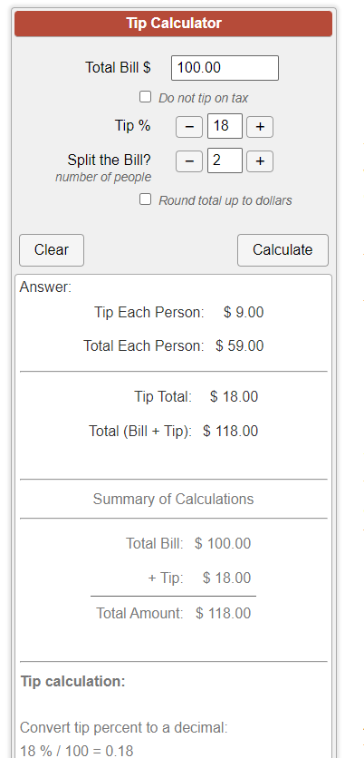

# 5.Tip Calculator
## Project Description
It is customary to leave a tip or gratuity for waitstaff and bartenders to recognize the quality of service a customer receives. In the United States people generally tip 15-20% of the bill.

To calculate tip multiply the total check by 1 plus the decimal percentage tip you'd like to leave. If you wanted to leave a 20% tip, you would add 1 to 0.20 to get 1.20. Multiply the bill by 1.20 to get the total amount you'd leave including tip.

Decide on tip percentage
Add the decimal form of tip percentage to 1 to get your rate
Multiply the bill by your rate
Alternatively you can calculate the percentage tip and then add it to the bill. You will get the same end result as using the tip calculation method above.

Decide on tip percentage
Multiply the bill by tip percentage as a decimal. This is the amount of tip you're leaving.
Add this amount to the bill
Increasingly, restaurants and other establishments include gratuity in the bill for larger parties. You can use the Tip Calculator to double-check the accuracy of those tip charges, or to leave a different gratuity amount if permitted.
## Features

## Technologies Used
- HTML
- CSS
- JavaScript
## Setup Instructions
1. Clone the repository.
2. Open index.html in your browser.
